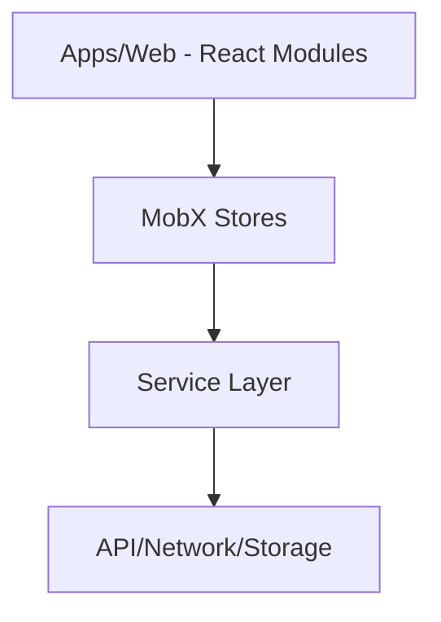

# System Architecture

Tài liệu này mô tả kiến trúc kỹ thuật của hệ thống.

## 🏗 Overall Architecture
Hệ thống sử dụng kiến trúc **Clean Architecture** kết hợp **Modular Frontend**:

## 1. Core Logic (packages/core)
Phần này cô lập business logic khỏi framework:
- **Stores**: Quản lý trạng thái toàn cục bằng MobX. Các Store liên kết với nhau qua `RootStore`.
- **Services**: Định nghĩa các API calls và data transformation.
- **Interfaces**: Định nghĩa các kiểu dữ liệu (DTOs) đồng bộ giữa Frontend và Backend.

## 2. Web Application (apps/web)
Phần này tập trung vào trình diễn:
- **Layouts**: Quản lý các vùng hiển thị chính (Sidebar, Header, Content).
- **Modules**: Mỗi module (ví dụ: Employee) chứa các screen và logic đặc thù cho module đó.
- **Base Components**: Các component nguyên tử (Atomic) và component phức hợp (Composite - như `BaseListView`) nằm trong thư mục `crm`.

## 3. Data Flow
1. **Action**: Người dùng tương tác với UI.
2. **Store Call**: UI gọi một action trong MobX Store.
3. **Service Call**: Store gọi Service để giao tiếp với API.
4. **State Update**: Store cập nhật dữ liệu vào state.
5. **UI Re-render**: Nhờ `observer`, UI tự động cập nhật mà không cần manual refresh.

## 4. Design System Integration
Các biến CSS được định nghĩa tập trung tại `apps/web/src/index.css`. Mọi component phải sử dụng các biến này thay vì hard-code mã màu để đảm bảo tính nhất quán và hỗ trợ Dark Mode hoàn hảo.

## 5. View Logic Separation
Mọi component hiển thị danh sách phức tạp phải ủy thác việc render card/table thông qua `BaseListView`. Điều này giúp việc bảo trì UI Grid/Table sau này chỉ cần sửa ở một nơi duy nhất.
